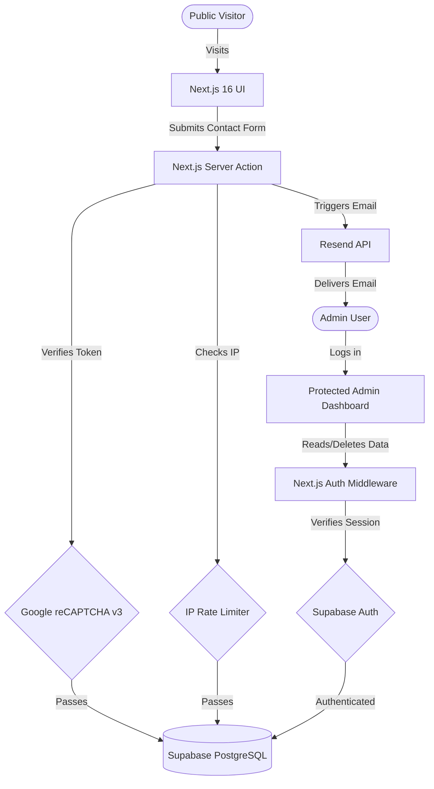

<div align="center">
  <h1 align="center">Next.js Premium Portfolio</h1>
  <p align="center">
    A high-performance, aesthetically premium developer portfolio built with the modern MERN/Next.js stack.
  </p>
</div>

---

## ✨ Features

- **Blazing Fast Performance**: Built on Next.js 16 (App Router) with Turbopack for near-instant load times.
- **Premium Design Aesthetics**: Carefully crafted UI using Tailwind CSS v4, featuring a sleek dark mode, glassmorphism, and subtle micro-animations.
- **Dynamic Content Architecture**: Case studies and project details are powered by local MDX files, allowing for rich, content-heavy project pages with markdown support.
- **Robust Form Handling**: Fully validated contact form using `react-hook-form` and `zod`.
- **Advanced Security & Bot Protection**:
  - **Google reCAPTCHA v3** integration for invisible bot detection.
  - Custom in-memory **IP Rate Limiting** on server actions to prevent brute-force attacks and spam.
- **Secure Admin Dashboard**:
  - Complete backend portal for reading and managing contact submissions.
  - Protected routes via **Next.js Middleware** and secure cookie-based auth.
- **Backend Integration**: 
  - Submissions and admin auth powered by **Supabase** via `@supabase/ssr` and `@supabase/supabase-js`.
  - Real-time email notifications are sent via the **Resend API**.
- **Real-time Live Chat**:
  - Global UI state managed flawlessly via **Redux Toolkit**.
  - Real-time bi-directional messaging powered by **Supabase WebSockets**.
- **Gemini AI Integration**: 
  - Dual-mode chat widget allows visitors to talk to a live admin or an **AI Assistant** powered by `gemini-2.0-flash`.
- **Advanced Admin Security**:
  - Enterprise-grade **Two-Factor Authentication (TOTP)** via Supabase Native MFA and Google Authenticator.
- **Interactive UI Components**: Leveraging `framer-motion` for fluid scroll animations, page transitions, and interactive elements.

## 🛠 Tech Stack

- **Framework**: [Next.js 16](https://nextjs.org/)
- **Styling**: [Tailwind CSS v4](https://tailwindcss.com/)
- **Animations**: [Framer Motion](https://www.framer.com/motion/)
- **Database & Auth**: [Supabase](https://supabase.com/) & `@supabase/ssr` (Includes Native MFA)
- **Email Service**: [Resend](https://resend.com/)
- **AI Integration**: [Google Gemini 2.0 API](https://ai.google.dev/)
- **State Management**: [Redux Toolkit](https://redux-toolkit.js.org/)
- **Icons**: [Lucide React](https://lucide.dev/)
- **Content**: MDX (Markdown + JSX)

## 🚀 Getting Started

### 1. Clone & Install Dependencies
```bash
git clone <repository-url>
cd portfolionext
npm install
```

### 2. Environment Variables
Create a `.env.local` file in the root directory and add your keys:

```env
# Supabase Configuration (REST API)
NEXT_PUBLIC_SUPABASE_URL=https://your-project.supabase.co
NEXT_PUBLIC_SUPABASE_ANON_KEY=your-anon-key

# Resend Configuration
RESEND_API_KEY=re_your_api_key
RESEND_TARGET_EMAIL=your-email@example.com

# Security Configuration
NEXT_PUBLIC_RECAPTCHA_SITE_KEY=your_site_key_here
RECAPTCHA_SECRET_KEY=your_secret_key_here

# AI Configuration
GEMINI_API_KEY=AIzaSy_your_gemini_key_here
```

### 3. Database & Auth Setup (Supabase)
Run the following SQL in your Supabase SQL Editor to create the contact table and configure Row Level Security:

```sql
create table if not exists contact_submissions (
  id uuid primary key default gen_random_uuid(),
  name text not null,
  email text not null,
  message text not null,
  read boolean not null default false,
  created_at timestamptz not null default now()
);

-- Allow anyone to insert contact submissions from your website
create policy "Allow public inserts" on contact_submissions
  for insert to anon with check (true);

-- Allow authenticated admin to read, update, and delete messages
create policy "Allow authenticated read" on contact_submissions
  for select to authenticated using (true);
create policy "Allow authenticated update" on contact_submissions
  for update to authenticated using (true);
create policy "Allow authenticated delete" on contact_submissions
  for delete to authenticated using (true);
```

**Admin User Setup:** Go to your Supabase Dashboard -> Authentication -> Add User -> Create New User to create your secure admin login credentials.

## 📊 System Architecture Graph

When viewed on GitHub, the following code automatically renders into a visual architecture diagram showing how the data flows through the application:



### 4. Run the Development Server
```bash
npm run dev
```
Open [http://localhost:3000](http://localhost:3000) in your browser.

## 📁 Project Structure

```text
src/
├── app/              # Next.js App Router (pages, layouts, server actions)
├── components/       # Shared UI components (navbar, footer, ui elements)
├── config/           # Site configuration (personal data, links, projects list)
├── features/         # Feature-based component slicing (home, contact)
├── lib/              # Utility functions and clients (Supabase, MDX processor)
└── styles/           # Global styles and Tailwind entry points
content/
└── projects/         # MDX files containing detailed case studies
```

## 📝 License

This project is licensed under the MIT License.

<!-- Force Vercel Build -->
